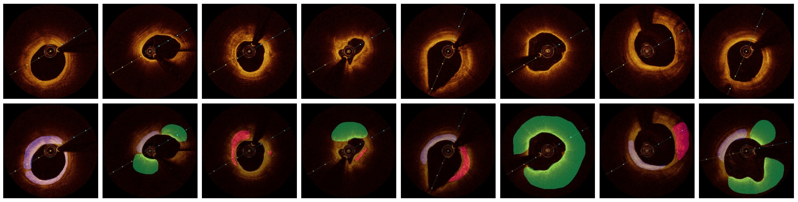
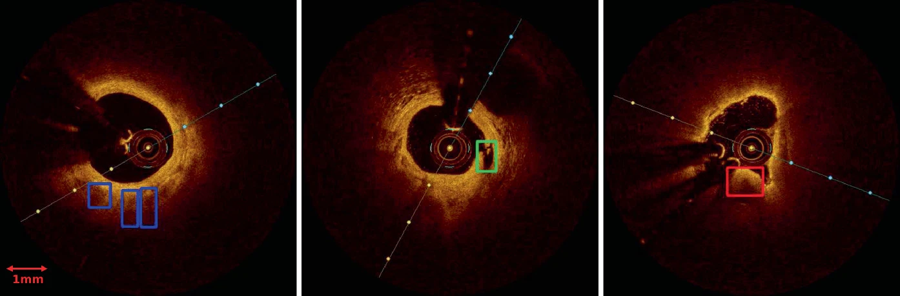
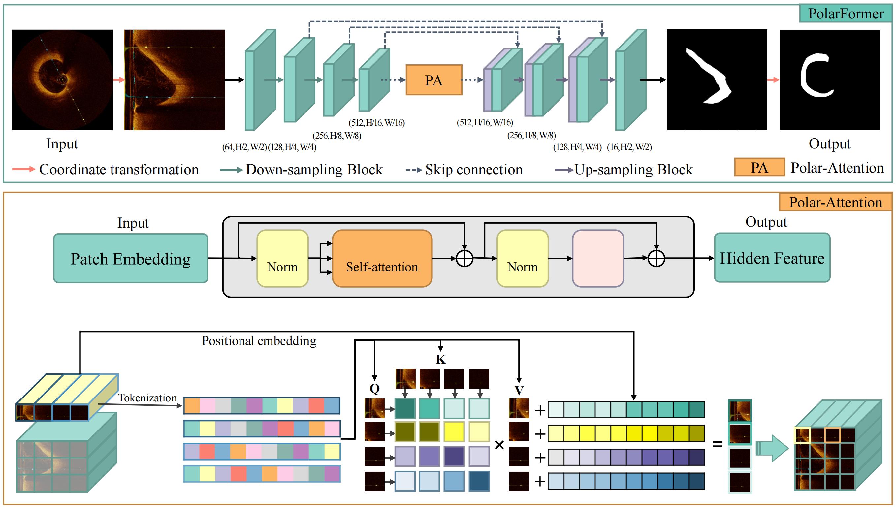
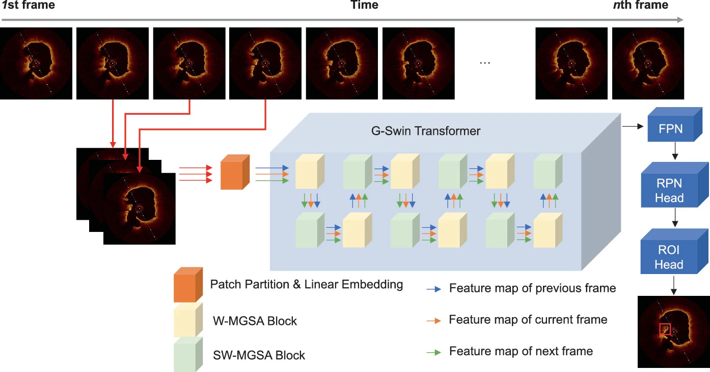

This is the official project page for our work on IVOCT lesion segmentation and detection.

Our lab page is available at [lab page](https://yuqian1023.github.io/).

Our research has been accepted for publication in the IEEE Transactions on Medical Imaging (TMI) 2024 and presented at MICCAI 2023.

*We collect a large-scale IVOCT dataset, including segmentation annotations and object detection annotations.*

We plan to share the dataset in the future. If you need access to the dataset, please contact us via email.

### PolarFormer: A Transformer-based Method for Multi-lesion Segmentation in Intravascular OCT
  

*Fig 1: The architecture of our proposed model PolarFormer. Top: Our model consists of an encoder and a decoder. The
encoder includes a three-layer downsampling CNN and our new Polar-Attention module. The decoder features a symmetrical
three-layer upsampling structure. The encoder and decoder are connected by skip connections. Bottom: Details of our proposed
Polar-Attention.*

The paper on IVOCT lesion segmentation is available here: [coming soon](#)

The code for IVOCT lesion segmentation can be found here: [coming soon](#)

### Vision Transformer Based Multi-class Lesion Detection in IVOCT
  

*Fig 2: We proposed a Vision Transformer-based model, called G-Swin Transformer, which uses adjacent frames as input and leverages the temporary dimensional information inherent in IVOCT data.*

The paper on IVOCT lesion detection is available here: [paper](https://link.springer.com/chapter/10.1007/978-3-031-43987-2_32)

The code for IVOCT lesion detection can be found here: [code](https://github.com/Shao1Fan/G-Swin-Transformer)
